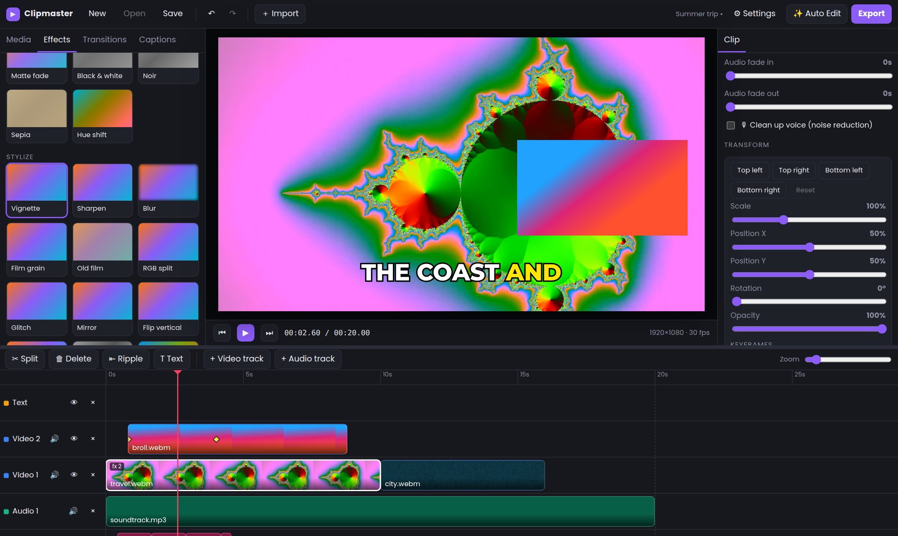
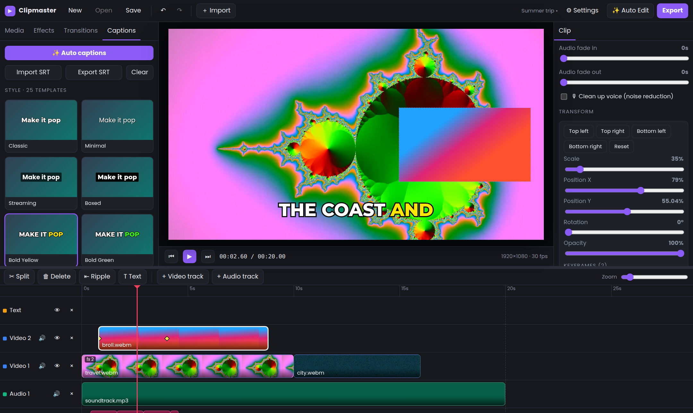
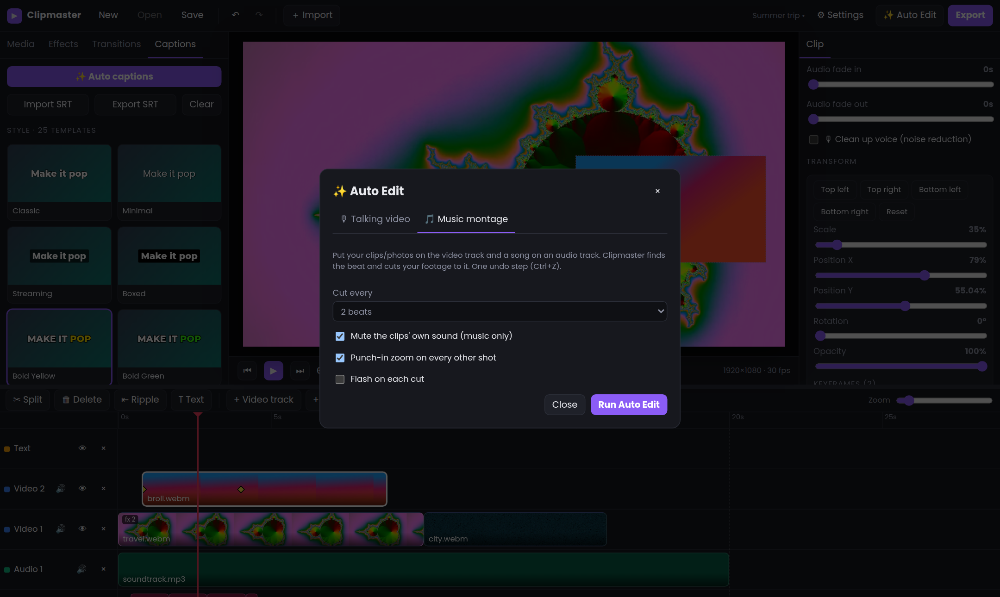
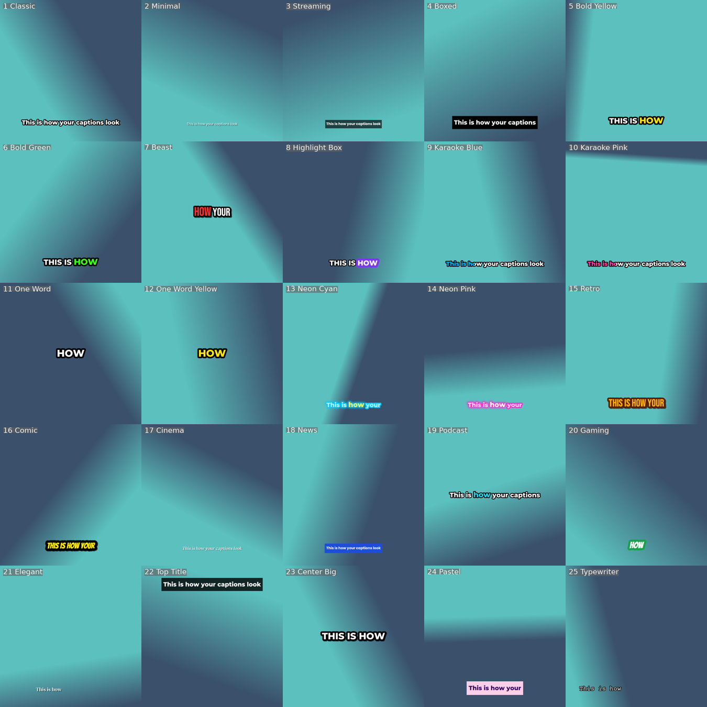

<p align="center"></p>

<h1 align="center">Clipmaster</h1>

<p align="center"><b>The free, open-source video editor for creators: a CapCut and Filmora alternative for Windows, macOS and Linux.</b><br>
Captions, effects, auto-edit and 4K export: no subscription, no watermark, no account, no cloud.</p>

<p align="center">
  <a href="LICENSE"></a>
  
  
  <a href="https://pankya1801.github.io/Clipmaster/"></a>
  <a href="../../releases"></a>
</p>

<p align="center"></p>

## Why Clipmaster?

Many popular editors keep auto-captions, effects or watermark-free export behind a paid plan, and they often upload your footage to their servers. Clipmaster does all of that **on your computer, for free, forever**:

- ✅ **No watermark, no export limits, up to 4K**
- ✅ **Auto captions that stay private.** Speech-to-text runs locally with whisper.cpp.
- ✅ **One-click Auto Edit** for talking videos (cuts out pauses) and music montages (cuts to the beat)
- ✅ **Made for Reels, Shorts and TikTok:** 9:16, 1:1 and 4:5 canvases, 25 trending caption styles
- ✅ **Open source (MIT).** Nobody can take features away or raise the price.

## Features

| | |
|---|---|
| **Timeline editing** | Multi-track video, audio and text. Trim, split, move and snap clips, ripple delete, duplicate, and unlimited undo/redo. |
| **Any format** | 16:9, 9:16 (Reels / Shorts / TikTok), 1:1, 4:5, 720p–4K, 24–60 fps. |
| **25 caption templates** | Word-by-word highlight, karaoke, one-word pop, neon, boxed, typewriter and more. Captions are rendered with real outlines and animations. |
| **Auto captions** | Runs [whisper.cpp](https://github.com/ggml-org/whisper.cpp) locally, so your audio never leaves your computer. One-click model download; you can also import or export SRT files. |
| **Picture-in-picture** | Position, scale, rotation and opacity for any clip. Drag it in the preview, or use the corner presets. |
| **Animated text & lower thirds** | 12 motion-graphics templates: pop, slide and neon titles, typewriter, quotes, name lower thirds, chapter tags, breaking-news banner, and subscribe/follow buttons. |
| **🎯 Auto zoom** | Punch-in and push-in zooms on the key words of your video, found automatically from the captions. |
| **Keyframe animation** | Animate position, scale, rotation and opacity with smooth easing. What you see in the preview is exactly what exports. |
| **32 effects** | Color grading (cinematic teal & orange, vintage, noir, warm/cool…), stylize (vignette, film grain, glitch, RGB split, pixelate…) and motion (Ken Burns, slow zoom, punch-in, camera shake). |
| **11 transitions** | Cross dissolve, fade, flash, four slides, zoom pop, blur in, fade out, dip to white. |
| **✨ Auto Edit** | *Talking video:* removes silences, hides jump cuts with punch-in zooms, adds captions and applies a look. *Music montage:* detects the song's beat and cuts your clips and photos to it. |
| **Audio** | Per-clip volume (0–200%), fades, speed 0.25×–4× with pitch-correct audio, one-click **voice clean-up** (noise reduction), **auto-ducking** of music under speech, and loudness normalization to −14 LUFS for social media. |
| **Export** | MP4 (H.264/AAC) with progress and cancel. No watermark, no limits. |
| **Safe** | Project files (`.clipmaster`), autosave and crash recovery. |

## Screenshots

| Animated captions (25 styles) | Picture-in-picture + keyframes |
|---|---|
|  |  |
| **✨ Auto Edit: music montage** | **Every caption template, as exported** |
|  |  |

## Install (users)

Download the installer for your system from the **Releases** page and run it. FFmpeg and whisper.cpp come bundled, so there is nothing else to set up.

- **Windows:** `.msi` or `-setup.exe`
- **macOS:** `.dmg` for Apple Silicon (`aarch64`) or Intel (`x64`). The app isn't notarized yet, so right-click → **Open** the first time.
- **Linux:** `.deb`, `.rpm` or `.AppImage`

**Auto captions:** open **⚙ Settings → Auto captions** and download a model once (75–466 MB). After that, captions work offline.

## Develop

Requirements: [Node 20+](https://nodejs.org), [Rust](https://rustup.rs), FFmpeg on your `PATH`, and the [Tauri prerequisites](https://v2.tauri.app/start/prerequisites/) for your OS. For auto captions in development, put `whisper-cli` on your `PATH` or set its path in Settings.

```bash
npm install
npm run tauri dev      # run the desktop app with hot reload
npm test               # unit tests + real FFmpeg render tests
npm run typecheck
npm run tauri build    # build an installer for your OS (uses FFmpeg from PATH)

# Build an installer with FFmpeg + whisper.cpp bundled (what releases use):
scripts/fetch-sidecars.sh x86_64-unknown-linux-gnu   # or your target triple
npm run tauri build -- --config src-tauri/tauri.bundle.conf.json
```

Pushing a tag like `v0.2.0` runs the Release workflow, which builds installers for all platforms as a draft GitHub release.

`npm run dev` also opens the editor in a normal browser for quick UI work. Import there is temporary and export is disabled.

### How it works

```
src/core/        Pure TypeScript, fully unit-tested
  project.ts     Timeline model and edit operations (trim, split, move, ripple…)
  ffmpeg.ts      Turns a project into one FFmpeg filter graph for export
  effects.ts     Effect and transition catalogue (FFmpeg filters + CSS preview)
  captions.ts    Caption templates → ASS subtitles (libass), SRT import/export
  autoedit.ts    Silence detection and jump-cut logic
  beats.ts       Beat detection and beat-synced montage
  keyframes.ts   Keyframe interpolation (shared by preview and export)
  textPresets.ts Animated text / lower-third templates (ASS)
  autozoom.ts    Emphasis detection → zoom keyframes
src/components/  React UI (preview, timeline, panels, dialogs)
src-tauri/       Rust backend: ffprobe, thumbnails, export runner, whisper
src-tauri/fonts  Caption fonts (SIL Open Font License)
```

The preview plays your media directly and approximates effects with CSS. Export renders everything exactly with FFmpeg.

## Roadmap

- Stickers, overlays and LUT import
- Background removal
- Speed ramps and freeze frames
- Templates you can share

## Contributing

Clipmaster is built in the open, and every contribution helps creators who can't afford expensive subscriptions. Read [CONTRIBUTING.md](CONTRIBUTING.md) to get started. Issues labelled **good first issue** are a great entry point.

If Clipmaster saves you money, **star the repo ⭐** and tell a creator friend. That's how open-source projects grow.

## License

[MIT](LICENSE) © 2026 The Clipmaster Authors.

Third-party components shipped with the installers keep their own licenses: FFmpeg ([GPL](https://ffmpeg.org/legal.html), run as a separate program; builds from [BtbN/FFmpeg-Builds](https://github.com/BtbN/FFmpeg-Builds) and [martin-riedl.de](https://ffmpeg.martin-riedl.de)), [whisper.cpp](https://github.com/ggml-org/whisper.cpp) (MIT) and the caption fonts ([SIL Open Font License](src-tauri/fonts/OFL.txt)). Their license texts are included in the app bundle.
